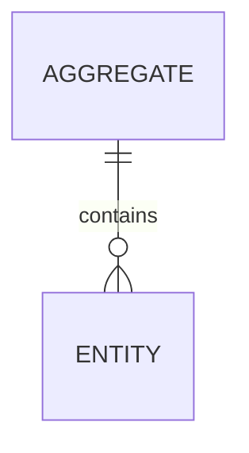
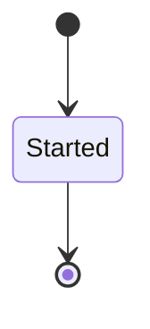

# `<Service>` service sheet

> Copy to `docs/plan/06-services/<service>.md`. Names come from `docs/brief/02-appendices/appendix-l-registry-and-id-codes.md`. Every section below is filled before the sheet is reviewed.

**Area code** `<AREA>` · **Tier** `<1 | 2>` · **Database** `nibras_<service>` · **Exchange** `nibras.<service>` · **Images** `nibras/<service>-api<, -worker>`

## 1. Responsibilities

| Owns | Does not own | Owner of that instead |
|---|---|---|
| `<capability>` | `<capability>` | `<Service>` |

One sentence on why this boundary exists: `<reason>`

## 2. Aggregates and entities

| Aggregate | Entity | Key fields | Invariants |
|---|---|---|---|
| `<Aggregate>` | `<Entity>` | `<fields>` | `<invariant>` |



## 3. REST API

| Method | Path | Permission | Request | Response | Errors | Idempotent by |
|---|---|---|---|---|---|---|
| `<GET>` | `<path>` | `<service>.<resource>.<action>` | `<type>` | `<type>` | `<SERVICE>_<MEANING>` | `<key or none>` |

## 4. gRPC contracts

| Direction | Service | Method | Purpose | Timeout | Fallback |
|---|---|---|---|---|---|

## 5. Events

| Direction | Routing key | Payload | Ordering key | Consumers or publisher |
|---|---|---|---|---|
| Publishes | `<service>.<entity>.<event>.v1` | `<fields>` | `<field>` | `<Service>` |

## 6. Sagas



| Step | Forward | Compensation | Idempotency key | Timeout |
|---|---|---|---|---|

## 7. Local reference copies

| Data copied | From | Kept current by | Staleness tolerated |
|---|---|---|---|

## 8. Background and long-running jobs

| Job | Schedule or trigger | Progress reporting | Failure behavior |
|---|---|---|---|

## 9. Permissions, notifications, settings

| Permission | Who holds it by default | Data scope |
|---|---|---|

| Notification | Trigger event or job | Recipients | Channels |
|---|---|---|---|

| Setting | Type | Default | Inferred from |
|---|---|---|---|

## 10. Folder and file tree

```text
src/Services/<Service>/
├── Nibras.<Service>.Domain/        # aggregates, rules, no dependencies
├── Nibras.<Service>.Application/   # one folder per use case
├── Nibras.<Service>.Infrastructure/# EF Core, messaging, caching
├── Nibras.<Service>.Api/           # endpoints, authorization, OpenAPI
└── Nibras.<Service>.Worker/        # background hosts, if any
```

## 11. Test plan

| Level | Covers | Test case IDs |
|---|---|---|

## 12. Caching table

| Data | Key | Tags | L1 | L2 | Invalidated by | Never cached |
|---|---|---|---|---|---|---|

## 13. Hot queries

| Query | Index | Expected rows | Pagination | Budget |
|---|---|---|---|---|

## 14. Scaling, partitioning, risks

| Concern | Design | Trigger to revisit |
|---|---|---|

| Risk | Likelihood | Impact | Mitigation | Owner |
|---|---|---|---|---|