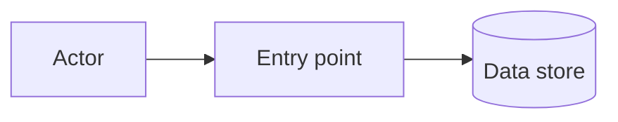

# Threat model: `<Service>`

> Copy to `docs/plan/12-security-privacy-safety/<service>.md` or into the service's security section. Every control maps to a test case ID.

**Area code** `<AREA>` · **Data sensitivity** per `docs/brief/02-appendices/appendix-j-data-classification-and-retention.md` · **Reviewed** `<date>` by `<who>`

## Boundaries

| Entry point | Type | Who reaches it | Authentication | Authorization |
|---|---|---|---|---|
| `<path or routing key>` | `<REST | gRPC | consumer | job | upload | webhook>` | `<role>` | `<mechanism>` | `<permission>` |

## STRIDE

| ID | Entry point | Category | Threat | Likelihood | Impact | Control | Test case ID |
|---|---|---|---|---|---|---|---|
| `T-01` | `<entry>` | Spoofing | `<threat>` | `<low/med/high>` | `<low/med/high>` | `<control>` | `TC-<AREA>-<NNN>` |

One row per threat, not one per category. Anything exposing a child's location, custody, health, or wellbeing record is critical impact regardless of likelihood.

## Abuse cases

| ID | Actor | Goal | Path they would take | Control | Test case ID |
|---|---|---|---|---|---|
| `A-01` | A logged-in parent in tenant A | Reach a child in tenant B | `<path>` | `<control>` | `TC-<AREA>-<NNN>` |

## Residual risk

| Risk | Why it remains | Accepted by | Review date |
|---|---|---|---|

## Test gaps

| Control | Test case ID missing | Owner |
|---|---|---|
